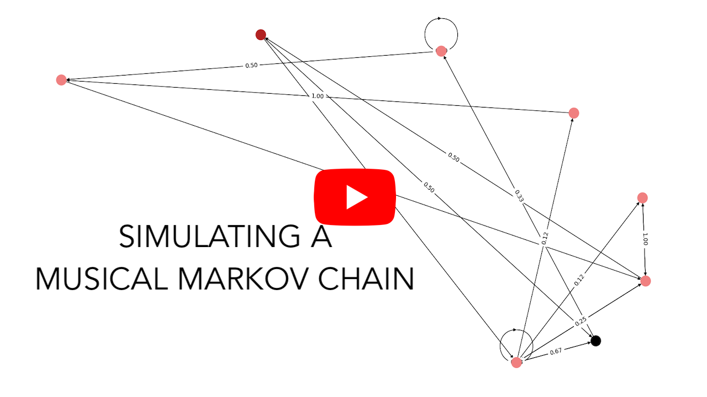

# Markov Chain Music Composer
ELI5: will "learn" from the piece of music you give it, and create new music that hopefully captures some features of the genre.

`create_markov_chain` will create a Markov chain whose states are chords in the piece of music you give it.
It will learn the conditional distribution of the next chord given the current.

NOTE: The Markov chain is a dict generated by `create_markov_chain`.

The key for the outer dict is the _current chord_ (a string inside a 1-tuple).

The value is a dict containing the **frequency** distribution of the next chord conditional on the current.
* The key for this inner dict is a _next chord_ (string) for the current chord.
* The values are the "learned" frequencies of the _next chord_ (inner key) conditional on the _previous chord_ (outer key).

Video example:
[](https://youtu.be/e6alPSeGzyw?si=A7vuZcsqxZfOTMZT)

# Usage
* Clone this repository
```sh
git clone https://github.com/ronitkunk/markovleafrag.git
```
* Install dependencies
```sh
pip install -r requirements.txt
```
* Create a text file containing the score for the piece you want to fit the Markov chain to, as a temporal sequence with space-separated chords. Chords are comma-separated ordered sets of integer frequencies.
```
77,155 103,207 415 155,207,261,311,622 415
```
* * there are sample files provided like `joplin/mapleleafrag.txt` and `vivaldi/fourseasonsspring.txt`.
* Run `markov_composer.py` with the correct command line arguments.
```python
python markov_composer.py [--input_path INPUT_PATH] [--look_back LOOK_BACK] [--play] [--plot] [--output_path OUTPUT_PATH] [--composition_length COMPOSITION_LENGTH]
```
* * (use the --help flag to see help text)
```python
python markov_composer.py --help
```

# Thanks
The .txt scores for Joplin and Vivaldi compositions have been derived from CC BY licensed MIDI files downloaded from [The Mutopia Project](https://www.mutopiaproject.org/ftp/).